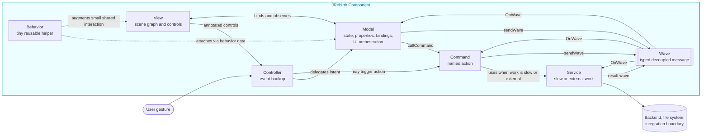

# JRebirth wB-CSMVC Reference

`wB-CSMVC` is the JRebirth role split around classic MVC:

- `w`: Waves for decoupled messages and typed payloads.
- `B`: Behaviors for tiny reusable cross-cutting interaction logic.
- `C`: Commands for explicit named actions.
- `S`: Services for slow, external, backend, or integration work.
- `MVC`: Model, View, Controller for a self-contained UI feature.

## Design Diagram

Open `wb-csmvc-diagram.svg` directly when Mermaid rendering is not available.

## Direction Rules

- Keep persistent feature state in the Model.
- Keep JavaFX node construction in the View.
- Keep user event translation in the Controller.
- Use Commands for named actions instead of long Controller methods.
- Use Services when work crosses an external boundary or should not live in UI logic.
- Use Waves only when communication must be decoupled across components.
- Use Behaviors only for small reusable interaction helpers; promote growing logic to a Command or Service.

## Feature Creation Order

1. Define the Model contract, state, bindings, and orchestration points.
2. Build the View scene graph and expose only the controls the Controller needs.
3. Wire gestures in the Controller and delegate to the Model or Commands.
4. Add Commands for explicit actions.
5. Add Services for external or long-running work.
6. Add Waves for cross-feature notification or decoupled orchestration.
7. Add Behaviors only when the same small interaction helper appears in multiple places.
